# Data Replication Sequence Diagrams

## 1. Purpose

This document describes the major data-replication and disaster-recovery flows for the PaySecure Gateway multi-region architecture.

The diagrams cover:

1. Aurora PostgreSQL replication
2. DynamoDB replication
3. Kafka event replication
4. Payment transaction and idempotency
5. Regional failover
6. Split-brain prevention
7. Post-failure data reconciliation

The diagrams use Mermaid sequence-diagram notation so they can be rendered directly by compatible Markdown viewers.

---

# 2. Aurora PostgreSQL Replication

Aurora PostgreSQL is responsible for critical relational data such as payment transactions and settlement information.

The normal replication flow is from the Mumbai primary database to the Hyderabad secondary database.

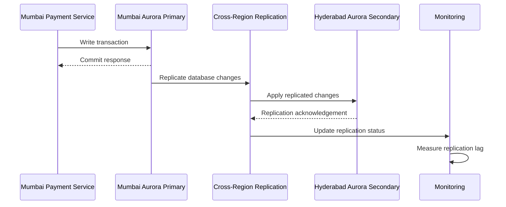

### Explanation

The application normally writes to the Mumbai Aurora writer.

Database changes are asynchronously replicated to Hyderabad.

The monitoring system continuously tracks replication health and lag.

If replication lag approaches the RPO threshold, an alert is generated.

---

# 3. Aurora Failover

The following sequence represents database recovery during a Mumbai regional failure.

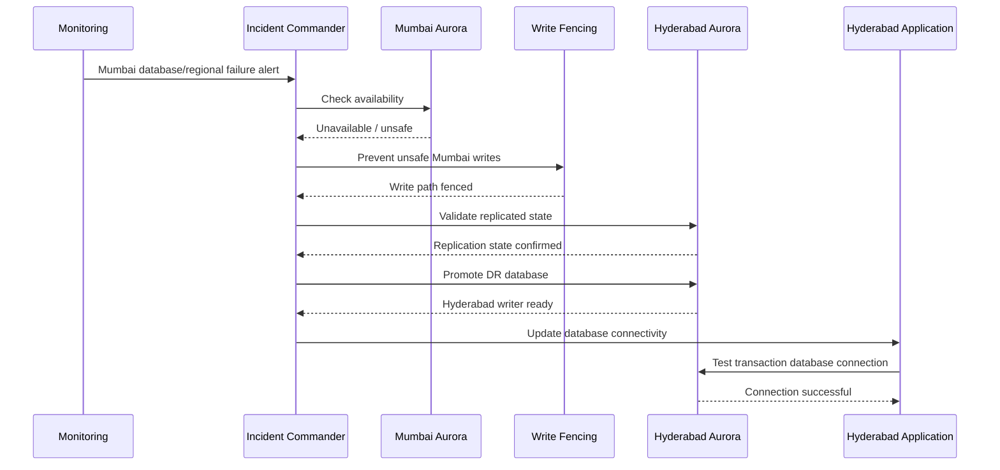

The sequence demonstrates why write fencing is required before promoting the secondary database.

---

# 4. DynamoDB Replication

DynamoDB is used for high-scale application data, including idempotency-related metadata and transaction metadata.

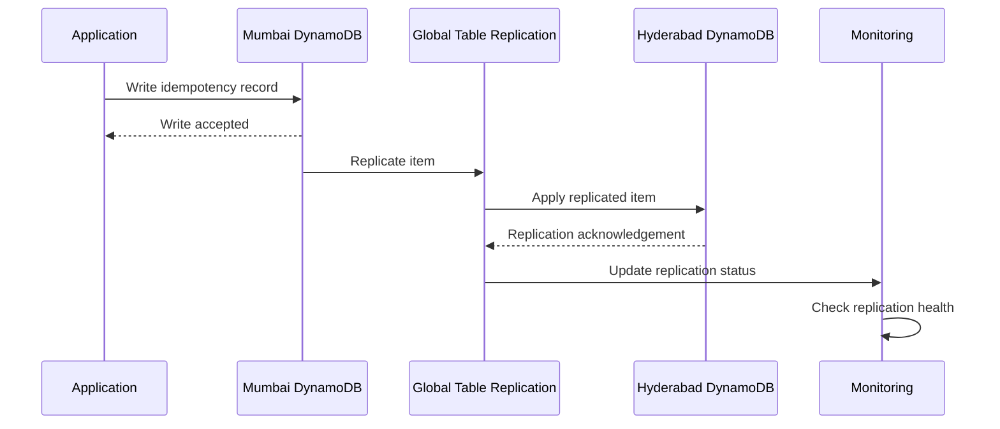

The replicated record allows the Hyderabad application to access required state during regional recovery.

---

# 5. Payment Transaction and Idempotency

Payment processing must protect against duplicate requests.

The idempotency key provides a stable reference for retries.

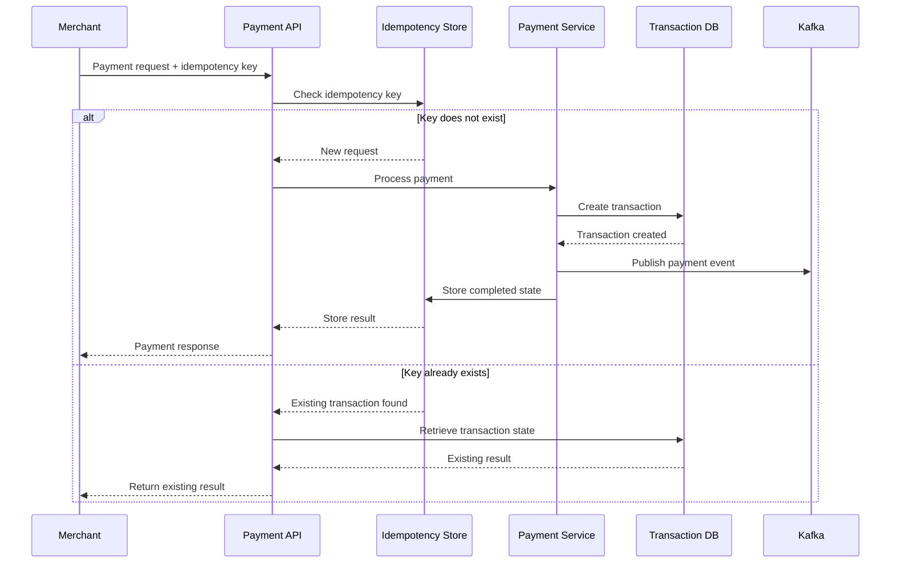

The second branch prevents the same merchant request from creating a second financial transaction.

---

# 6. Kafka Event Replication

Kafka carries asynchronous payment, settlement, webhook, notification, and audit events.

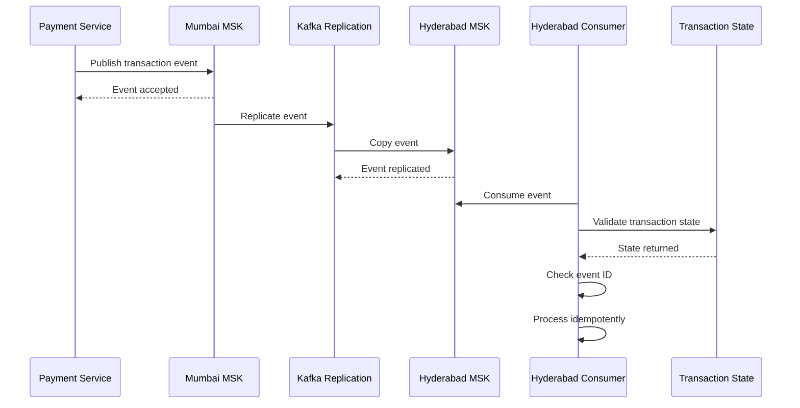

Each event should contain a unique event ID and transaction ID.

---

# 7. Kafka Duplicate Event Handling

Replicated events can potentially be delivered more than once.

The consumer therefore checks the event identifier before applying a financial side effect.

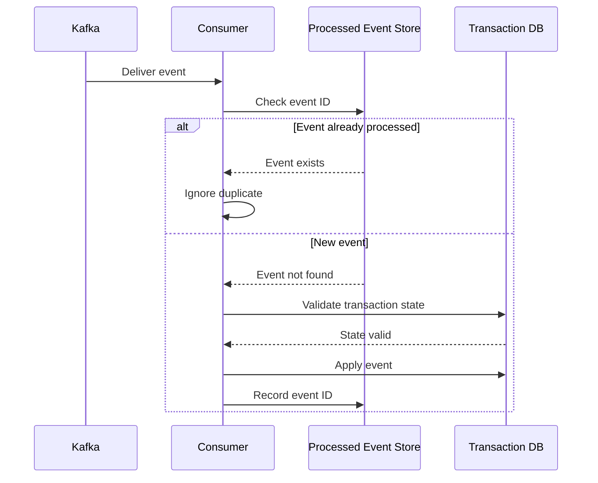

This mechanism protects settlement and other event-driven workflows from duplicate side effects.

---

# 8. Active-Passive Regional Failover

The active-passive architecture keeps Mumbai active and Hyderabad as warm standby.

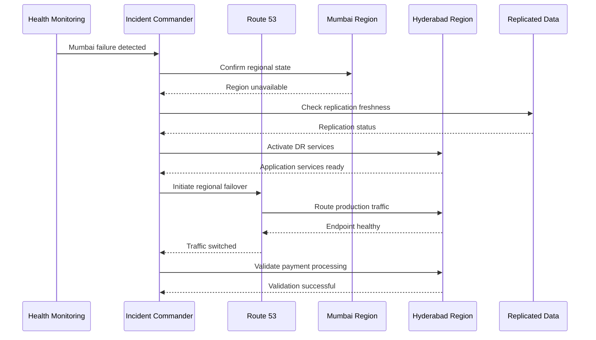

The failover process includes detection, confirmation, data validation, DR activation, DNS change, and transaction validation.

---

# 9. Active-Active Regional Failure

In active-active mode, both regions normally serve traffic.

If one region fails, the healthy region continues serving traffic.

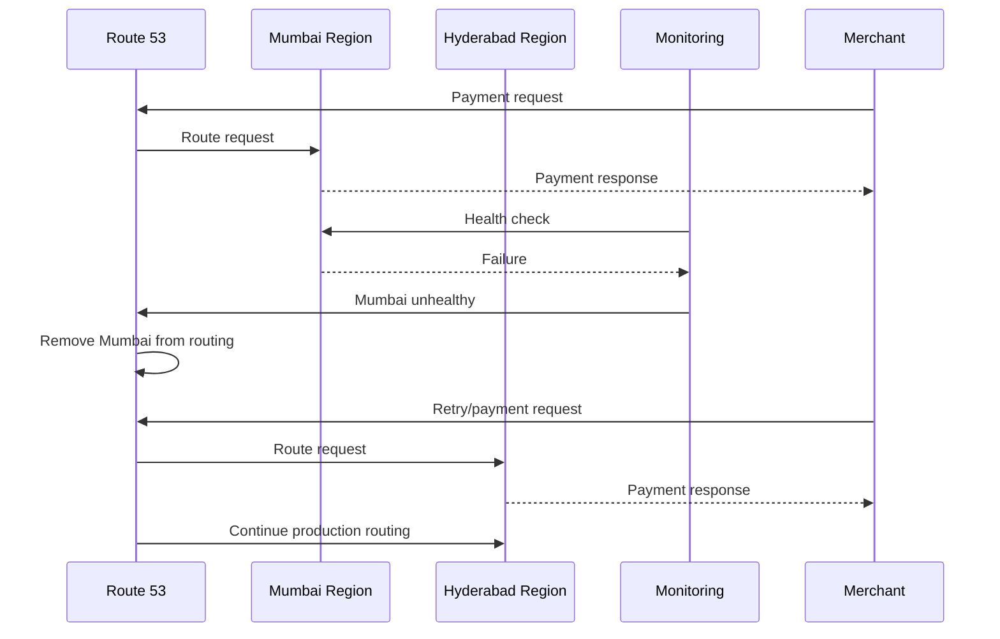

The surviving region must have sufficient capacity to handle the additional traffic.

---

# 10. Split-Brain Prevention

A network partition can leave both regions operational while preventing communication between them.

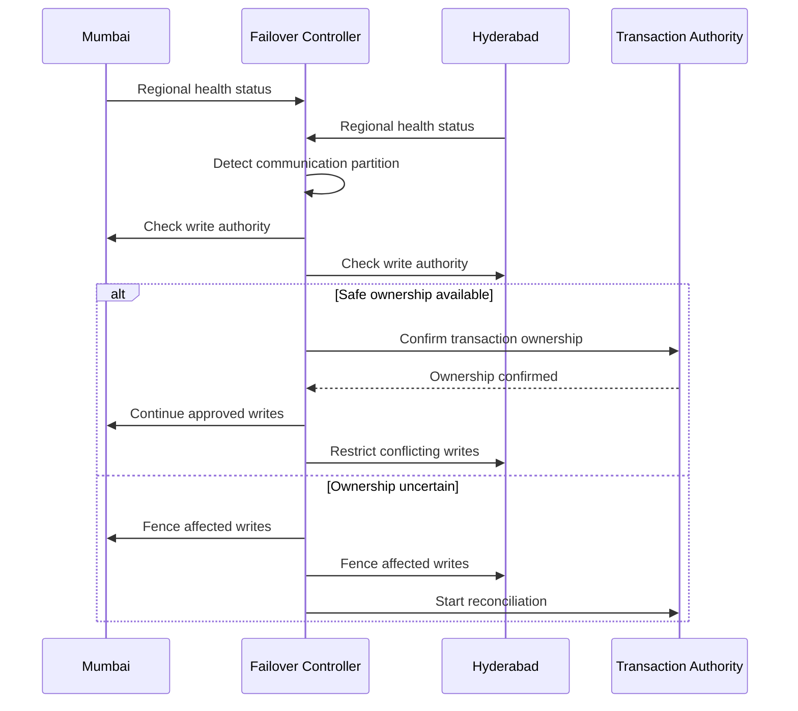

The objective is to prevent two regions from independently becoming authoritative for the same financial transaction.

---

# 11. Transaction State Validation

Every financial state transition must be validated.

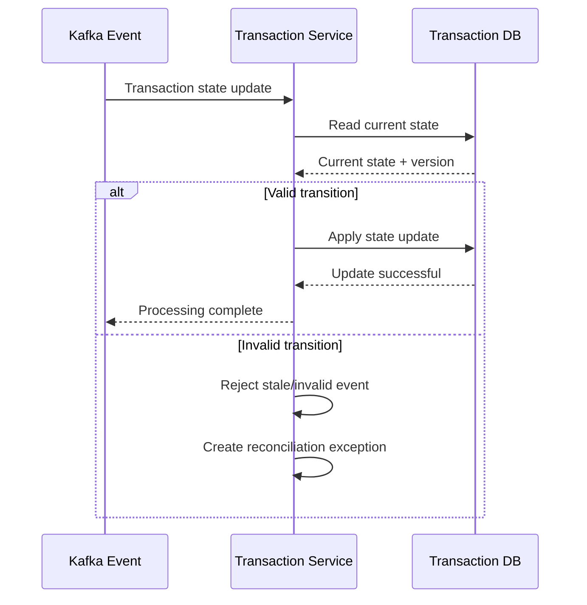

This protects against delayed events and incorrect state transitions.

---

# 12. Replication Failure Detection

Replication failure should be detected before a disaster occurs.

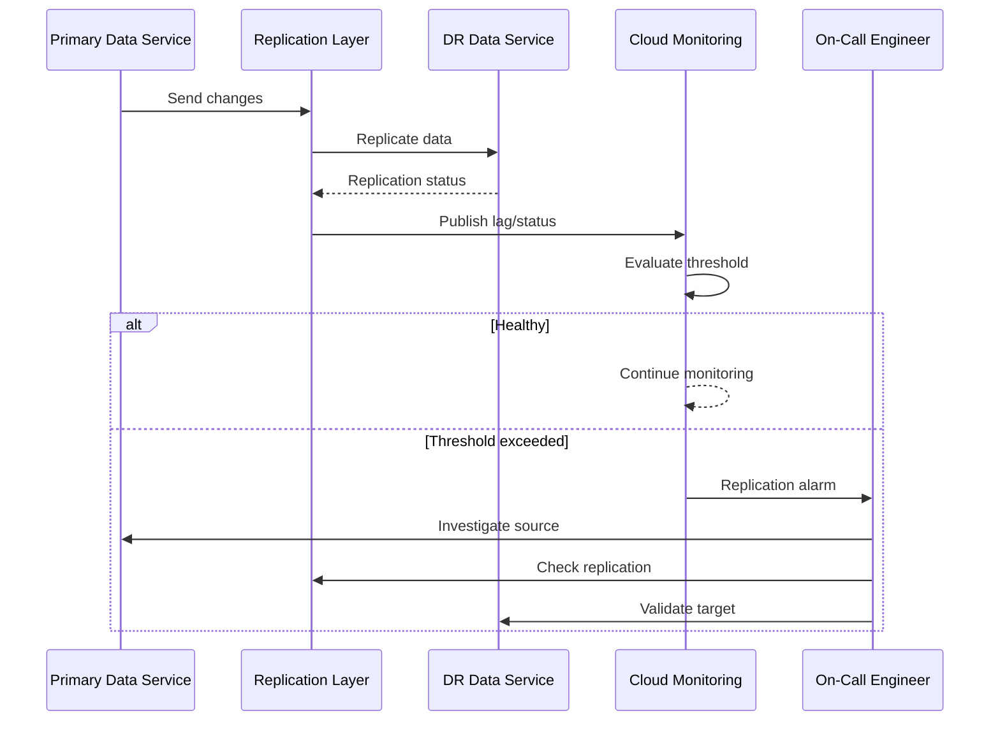

Replication monitoring is an important part of maintaining the sub-one-minute RPO objective.

---

# 13. Post-Failure Reconciliation

After a regional failure, transactions processed immediately before the incident may require reconciliation.

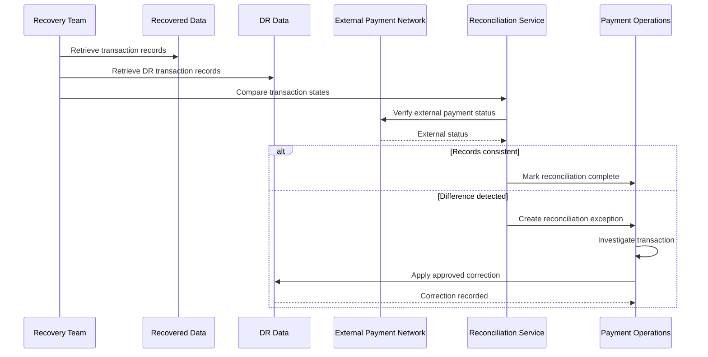

Reconciliation ensures that internal payment state, replicated state, and external payment results are aligned after recovery.

---

# 14. End-to-End Disaster Recovery Flow

The complete regional recovery process combines monitoring, replication, failover, and validation.

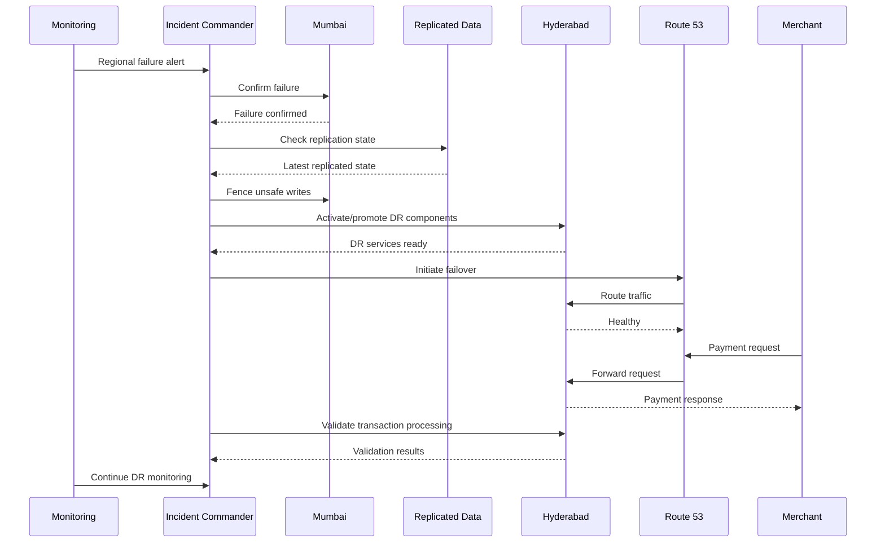

---

# 15. RPO Measurement Flow

The RPO must be measured during disaster recovery drills.

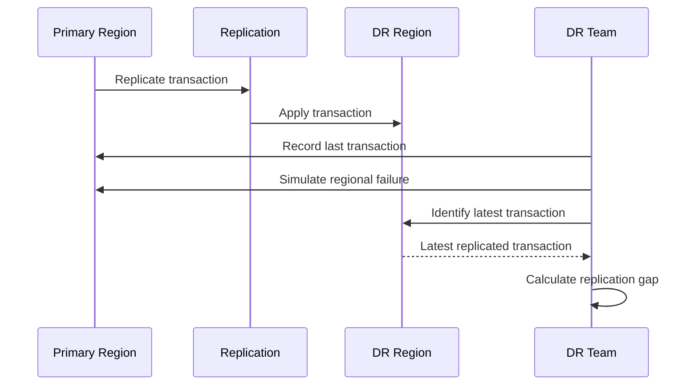

The measured replication gap should be compared with the project's less-than-one-minute RPO objective.

---

# 16. RTO Measurement Flow

RTO is measured from the beginning of the disaster event to the first successful recovered transaction.

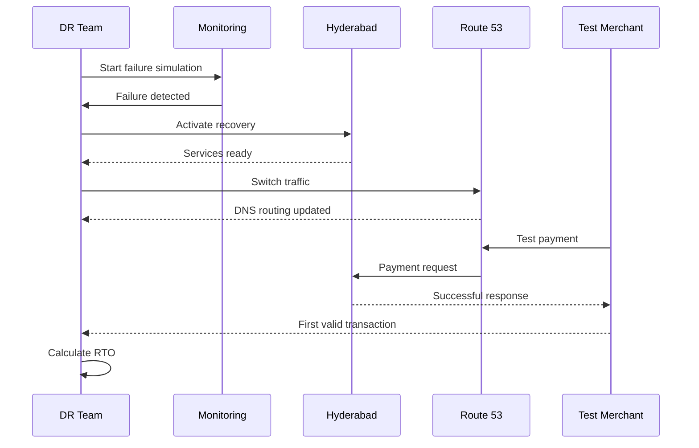

The measured RTO should be compared with the project's less-than-five-minute target.

---

# 17. Sequence Diagram Summary

The diagrams demonstrate the core principles of the PaySecure DR architecture:

* Continuous regional replication
* Service-specific replication
* Idempotent payment processing
* Kafka event identification
* Transaction-state validation
* Controlled regional failover
* Split-brain prevention
* Replication monitoring
* Post-failure reconciliation
* Measured RPO and RTO

The sequence diagrams should be used together with the replication strategy, DNS failover design, and disaster recovery runbooks.

The diagrams represent the intended architecture and operational flows. Actual AWS configuration, replication lag, DNS behavior, and recovery timings must be validated through implementation and controlled DR testing.
