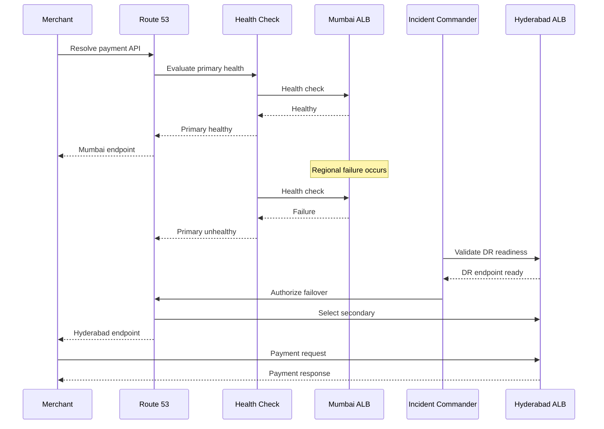

# DNS Failover Design

## 1. Purpose

The PaySecure Gateway requires automated traffic redirection during a regional disaster.

The DNS failover layer provides controlled routing between the Mumbai primary region (`ap-south-1`) and Hyderabad disaster recovery region (`ap-south-2`).

The design uses Amazon Route 53 health checks and failover routing to detect an unhealthy primary endpoint and redirect traffic to the DR endpoint.

The DNS layer is one part of the complete disaster recovery mechanism. It must operate together with application health checks, database promotion, replicated data, Kafka recovery, security controls, and operational runbooks.

---

## 2. Regional Endpoints

| Component     | Mumbai            | Hyderabad        |
| ------------- | ----------------- | ---------------- |
| Region        | `ap-south-1`      | `ap-south-2`     |
| Role          | Primary           | DR               |
| Application   | EKS               | EKS              |
| Load Balancer | ALB               | ALB              |
| Database      | Aurora Primary    | Aurora Secondary |
| DNS Role      | Primary           | Secondary        |
| Traffic       | Normal production | Failover traffic |

The public payment API is exposed through regional Application Load Balancers.

Example logical endpoints:

```text
Mumbai:
api-mum.paysecure.example

Hyderabad:
api-hyd.paysecure.example
```

The actual production domain must be substituted during implementation.

---

## 3. Route 53 Failover Strategy

The recommended routing model for the active-passive configuration is Route 53 failover routing.

The primary record points to the Mumbai ALB.

The secondary record points to the Hyderabad ALB.

```text
                    PaySecure API
                         |
                    Route 53 DNS
                         |
             +-----------+-----------+
             |                       |
        PRIMARY                  SECONDARY
       Mumbai                    Hyderabad
     ap-south-1                  ap-south-2
         |                           |
       ALB                         ALB
         |                           |
       EKS                         EKS
         |                           |
   Payment Services           DR Payment Services
```

Under normal conditions, traffic is directed to Mumbai.

When the primary health check fails and the failover process is authorized, Route 53 can return the secondary endpoint.

---

## 4. Health Check Design

Health checks should not depend only on whether an EC2 instance, Kubernetes node, or load balancer is reachable.

The application should expose a dedicated health endpoint.

Example:

```text
GET /health
```

A deeper readiness endpoint can also be used:

```text
GET /ready
```

### `/health`

Checks basic application availability.

### `/ready`

Checks whether the service is ready to process production traffic.

The readiness check should consider:

* Application process
* Required internal dependencies
* Database connectivity
* Required configuration
* Critical downstream connectivity
* Regional operational state

A service should not be considered ready merely because its process is running.

---

## 5. Health Check Layers

The DR design uses multiple monitoring layers.

```text
Internet
   |
Route 53 Health Check
   |
Regional ALB
   |
Application Health Endpoint
   |
Application Dependencies
   |
Database / Kafka / Cache
```

This layered approach reduces the possibility of routing traffic to an endpoint that is reachable but not capable of processing payments.

---

## 6. Health Check Failure Logic

The logical decision flow is:

```text
START
  |
  v
Check Mumbai endpoint
  |
  +---- Healthy ----> Continue Mumbai traffic
  |
  +---- Unhealthy
           |
           v
     Confirm failure
           |
           v
     Check application
           |
           +---- Healthy --> Investigate monitoring/network issue
           |
           +---- Unhealthy
                    |
                    v
              Check database
                    |
                    v
              Check replication
                    |
                    v
              Activate DR
                    |
                    v
             Validate Hyderabad
                    |
                    v
              Route traffic
```

DNS routing should be part of a controlled failover process rather than the only recovery mechanism.

---

## 7. Failover Sequence



---

## 8. Failover Preconditions

Before switching production traffic to Hyderabad, the following conditions should be checked:

1. Mumbai failure is confirmed.
2. The failure is not only a monitoring false positive.
3. Hyderabad infrastructure is available.
4. Application pods are healthy.
5. Aurora DR database is available.
6. Database replication status is acceptable.
7. Kafka recovery/replication status is acceptable.
8. Required secrets and KMS access are available.
9. Security controls are operational.
10. Hyderabad has sufficient capacity.
11. Payment processing smoke tests pass.
12. Incident Commander authorizes failover.

---

## 9. Health Check Configuration Principles

Example configuration:

```yaml
health_check:
  name: paysecure-mumbai-api
  type: HTTPS
  endpoint: /health
  port: 443
  interval_seconds: 10
  failure_threshold: 3
  request_timeout_seconds: 5
  expected_status_code: 200

secondary_health_check:
  name: paysecure-hyderabad-api
  type: HTTPS
  endpoint: /health
  port: 443
  interval_seconds: 10
  failure_threshold: 3
  request_timeout_seconds: 5
  expected_status_code: 200
```

The exact values must be validated during implementation and DR testing.

---

## 10. Failback Strategy

Failback should not happen immediately after Mumbai becomes reachable.

A recovered region must first be validated.

The process should be:

```text
Mumbai recovery
      |
      v
Infrastructure validation
      |
      v
Application validation
      |
      v
Database validation
      |
      v
Replication catch-up
      |
      v
Security validation
      |
      v
Smoke testing
      |
      v
Controlled traffic restoration
```

The recovery team should confirm that Mumbai is fully synchronized before restoring production traffic.

---

## 11. DNS TTL Considerations

DNS caching can affect how quickly clients observe a routing change.

The design should therefore use an appropriate TTL for the production API records.

The selected TTL must balance:

* Failover responsiveness
* DNS query volume
* Resolver caching
* Operational stability

Actual failover time must be measured during DR drills because DNS TTL alone does not define complete application recovery time.

---

## 12. False Positive Protection

A temporary network issue should not automatically trigger an uncontrolled regional disaster declaration.

The operational process should distinguish:

```text
Single health-check failure
        |
        v
Repeated health-check failures
        |
        v
Application validation
        |
        v
Regional failure confirmation
        |
        v
DR decision
```

Monitoring alarms, application metrics, database status, and regional infrastructure status should be correlated before a major failover decision.

---

## 13. Security Controls

DNS failover must preserve the same security posture in both regions.

The Hyderabad environment should have:

* TLS certificates
* WAF policies
* Authentication controls
* Authorization controls
* KMS permissions
* Secrets
* Network security rules
* Logging
* Monitoring
* Audit trails
* Required PCI-related controls

Failover must not bypass security controls simply to restore availability.

---

## 14. Monitoring and Alerting

The following conditions should generate operational alerts:

| Condition                             | Severity |
| ------------------------------------- | -------- |
| Primary health check failure          | High     |
| Multiple consecutive failures         | Critical |
| DR health check failure               | Critical |
| Replication lag threshold exceeded    | High     |
| DNS failover initiated                | Critical |
| Hyderabad capacity threshold exceeded | High     |
| Payment smoke test failure            | Critical |
| Unexpected DNS configuration change   | Critical |

Alerts should be integrated with the organization's incident-management process.

---

## 15. Failover Validation

After DNS failover, the recovery team should validate:

```text
DNS resolution
      ↓
TLS handshake
      ↓
ALB response
      ↓
Application authentication
      ↓
Payment API
      ↓
Idempotency
      ↓
Database write
      ↓
Kafka event
      ↓
Merchant response
```

A successful DNS change alone does not prove that payment processing has recovered.

---

## 16. Rollback / Failback Decision

If Hyderabad fails validation after failover:

```text
Hyderabad validation
       |
       +---- PASS ----> Continue DR operations
       |
       +---- FAIL
              |
              v
        Stop production cutover
              |
              v
        Investigate failure
              |
              +---- Mumbai recoverable
              |        |
              |        v
              |   Validate Mumbai
              |
              +---- Mumbai unavailable
                       |
                       v
                 Continue DR recovery
```

The Incident Commander should own the final operational decision.

---

## 17. Audit Requirements

Every DNS failover should produce an auditable record containing:

* Incident ID
* Start timestamp
* Detection timestamp
* Health-check evidence
* Failover authorization
* DNS change details
* Database status
* Replication lag
* Application validation results
* First successful transaction
* Recovery timestamp
* Failback timestamp
* People involved
* Customer/merchant impact
* Regulatory communication where applicable

These records support post-incident analysis and DR compliance evidence.

---

## 18. Design Summary

The DNS failover architecture provides the traffic-routing mechanism required for regional disaster recovery.

The design uses:

* Route 53 failover routing
* Primary Mumbai endpoint
* Secondary Hyderabad endpoint
* Application health checks
* Multi-layer monitoring
* Controlled failover authorization
* Security-preserving DR endpoints
* Measured failover and recovery times
* Controlled failback

DNS is treated as one component of the overall DR architecture rather than as a replacement for application, database, messaging, security, and operational recovery procedures.

All timing values and thresholds should be validated through controlled DR drills before being considered production-approved.
