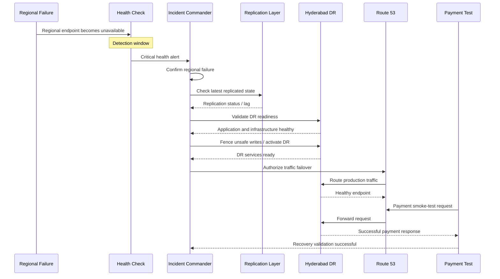

# PaySecure Gateway — Failover Timing Diagram

## 1. Objective

This document defines the expected timing sequence for regional disaster recovery.

The project target is:

* **RPO:** less than 1 minute
* **RTO:** less than 5 minutes

The actual timings must be validated through controlled disaster recovery drills.

---

## 2. Target Failover Timeline

```text
Regional Failure
      |
      | 0:00
      v
+-----------------------------+
| Regional failure occurs     |
+-----------------------------+
      |
      | 0:00 - 0:30
      v
+-----------------------------+
| Health checks detect issue  |
+-----------------------------+
      |
      | 0:30 - 1:00
      v
+-----------------------------+
| Engineering validates       |
| regional failure            |
+-----------------------------+
      |
      | 1:00 - 2:00
      v
+-----------------------------+
| Check replication status    |
| and DR readiness             |
+-----------------------------+
      |
      | 2:00 - 3:00
      v
+-----------------------------+
| Fence unsafe writes         |
| Promote/activate DR         |
+-----------------------------+
      |
      | 3:00 - 4:00
      v
+-----------------------------+
| Route traffic to Hyderabad  |
+-----------------------------+
      |
      | 4:00 - 5:00
      v
+-----------------------------+
| Payment smoke test          |
| and recovery validation     |
+-----------------------------+
      |
      v
DR SERVICE OPERATIONAL
```

---

## 3. Detailed Timing Table

| Phase | Activity                     | Target Window |
| ----- | ---------------------------- | ------------: |
| T0    | Regional failure             |         0 min |
| T1    | Health-check detection       |       0–1 min |
| T2    | Incident confirmation        |   0.5–1.5 min |
| T3    | Replication/RPO validation   |       1–2 min |
| T4    | Write fencing                |       2–3 min |
| T5    | DR application activation    |       2–3 min |
| T6    | Database promotion/readiness |       2–4 min |
| T7    | DNS traffic failover         |       3–4 min |
| T8    | Payment smoke test           |       4–5 min |
| T9    | Recovery confirmed           | Target <5 min |

These values are planning targets and must be measured during DR testing.

---

## 4. Mermaid Timing Sequence



---

## 5. RPO Timing

RPO measures the amount of data that may not have reached the DR environment when the primary region fails.

Example:

```text
Last transaction committed in Mumbai:
10:00:59

Latest transaction replicated to Hyderabad:
10:00:42

Replication gap:
17 seconds
```

In this example:

```text
RPO = 17 seconds
```

The target is:

```text
RPO < 60 seconds
```

If the measured replication gap exceeds the target, the incident commander should treat the recovery as an RPO exception and initiate reconciliation procedures.

---

## 6. RTO Timing

RTO measures how long it takes to restore the required payment service after the disaster begins.

Example:

```text
Failure detected:
10:00:00

Traffic successfully serving from Hyderabad:
10:04:12

Measured recovery time:
4 minutes 12 seconds
```

The target is:

```text
RTO < 5 minutes
```

The exact start and end timestamps must be recorded during every DR drill.

---

## 7. Timing Dependencies

The overall recovery time depends on several independent activities.

```text
Detection
   |
   +--> Incident confirmation
   |
   +--> Replication validation
   |
   +--> DR capacity validation
   |
   +--> Database readiness
   |
   +--> Kafka readiness
   |
   +--> DNS failover
   |
   +--> Application validation
   |
   +--> Payment smoke test
```

A delay in any critical dependency can increase total recovery time.

---

## 8. DNS Timing Considerations

DNS failover timing is affected by:

* Health-check detection
* Health-check failure threshold
* Resolver caching
* DNS TTL
* Client DNS behavior
* Network conditions
* Application readiness

Therefore, a Route 53 configuration change should not be considered equivalent to complete application recovery.

The DR drill must measure the time from failure initiation to the first successfully processed payment transaction.

---

## 9. Failover Success Criteria

A regional failover is considered successful when all of the following are satisfied:

* Hyderabad application is healthy.
* Database is available for production processing.
* Replication state has been validated.
* Required Kafka services are available.
* DNS resolves to the intended DR endpoint.
* TLS connection succeeds.
* Authentication succeeds.
* Idempotency checks work.
* Payment smoke test succeeds.
* Transaction event is processed.
* Monitoring confirms stable service.
* Recovery time remains within the target.

---

## 10. Timing Evidence

The following evidence should be collected during every DR exercise:

```text
Incident ID:
Drill Date:
Failure Start Time:
Detection Time:
Incident Confirmation Time:
Replication Validation Time:
DR Activation Time:
DNS Failover Time:
First Successful Transaction:
Recovery Confirmation Time:
Failback Time:
```

The timestamps should be taken from synchronized operational systems wherever possible.

---

## 11. RPO/RTO Calculation

### RPO

```text
RPO = Failure Timestamp - Latest Replicated Transaction Timestamp
```

### RTO

```text
RTO = First Successful Recovered Transaction Timestamp
       - Disaster Start Timestamp
```

The measured values should be documented in the post-drill report.

---

## 12. Timing Exception Handling

If the recovery exceeds the target:

```text
Recovery exceeds 5 minutes
          |
          v
Identify delayed phase
          |
          +---- Detection delay
          |
          +---- Database delay
          |
          +---- Kafka delay
          |
          +---- DNS/client caching delay
          |
          +---- Application readiness delay
          |
          v
Create corrective action
          |
          v
Repeat DR test
```

If the RPO exceeds one minute, the team should identify the replication bottleneck and perform transaction reconciliation.

---

## 13. Operational Principle

The five-minute RTO and one-minute RPO are **objectives to be demonstrated through testing**, not assumptions.

Every DR drill should compare:

```text
TARGET
  ↓
ACTUAL MEASUREMENT
  ↓
GAP
  ↓
ROOT CAUSE
  ↓
CORRECTIVE ACTION
  ↓
RETEST
```

This creates measurable evidence that the PaySecure Gateway disaster recovery architecture is progressing toward its availability and recovery objectives.
