# PaySecure Gateway — Data Flow Diagrams

## 1. Purpose

This document describes how payment, transaction, replication, and failover data flows through the PaySecure Gateway multi-region architecture.

The diagrams cover:

1. Normal Mumbai production traffic
2. Cross-region data replication
3. Mumbai regional failure
4. Hyderabad DR processing
5. Recovery and reconciliation

The design keeps payment-processing workloads within the Indian AWS regions used by the project:

* Primary: `ap-south-1` — Mumbai
* DR: `ap-south-2` — Hyderabad

---

# 2. Normal Production Data Flow

Under normal operating conditions, Mumbai handles production payment traffic.

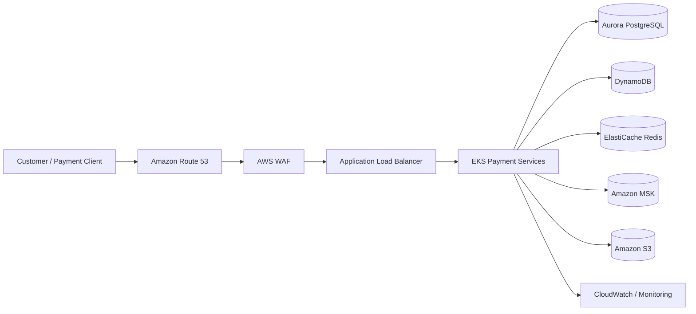

### Flow Description

1. The customer sends a payment request.
2. Route 53 resolves the PaySecure payment endpoint.
3. AWS WAF evaluates the incoming request.
4. The Application Load Balancer forwards valid traffic to EKS.
5. Payment services process the transaction.
6. Aurora PostgreSQL stores authoritative relational transaction state.
7. DynamoDB stores distributed application data where required.
8. Redis provides low-latency cache access.
9. Kafka/MSK carries asynchronous payment and settlement events.
10. S3 stores appropriate objects and audit-related data.
11. CloudWatch and monitoring systems observe application and infrastructure health.

---

# 3. Cross-Region Replication Flow

Mumbai continuously replicates required data to the Hyderabad DR environment.

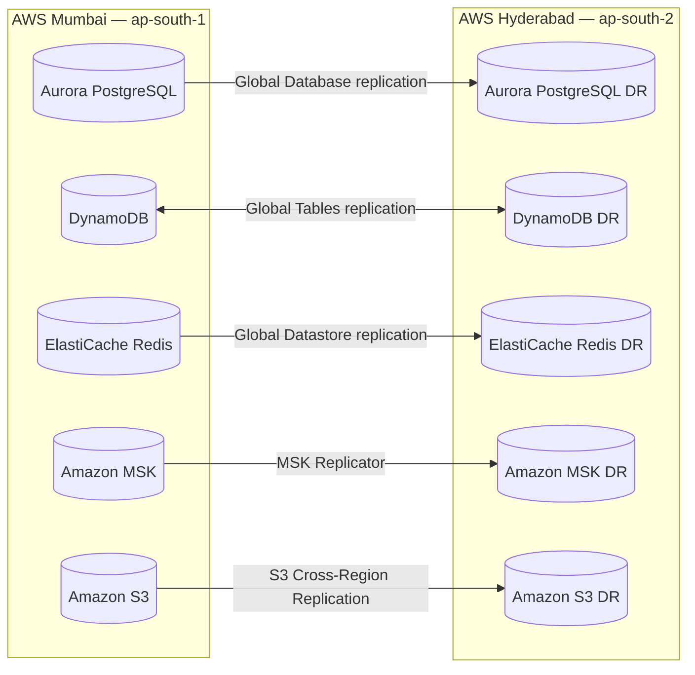

## Replication Characteristics

### Aurora PostgreSQL

Aurora Global Database provides cross-region replication for the relational database layer.

The design monitors replication lag continuously.

The DR objective is:

```text
RPO < 1 minute
```

### DynamoDB

DynamoDB Global Tables provide multi-region replication.

Application logic must maintain idempotency and transaction correctness.

### ElastiCache Redis

Redis replication maintains the required cache state in the DR region.

The cache is not treated as the authoritative source for financial transactions.

### Amazon MSK

Kafka topics and required consumer state are replicated to the secondary environment.

Replication lag must be monitored because asynchronous replication can introduce delayed events.

### Amazon S3

Required objects are replicated from Mumbai to Hyderabad.

Replication status is monitored to ensure DR readiness.

---

# 4. Payment Data Sovereignty Flow

Payment-related data remains within the Indian regions used by the architecture.

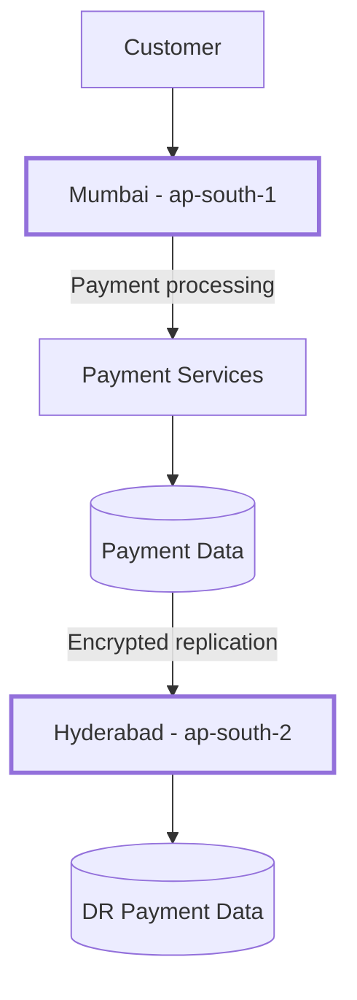

The intended design does not replicate payment databases to an overseas AWS region.

Operational data that is not subject to the same payment-data restrictions must still undergo security and compliance review before any external processing is enabled.

---

# 5. Regional Failure Flow

If Mumbai becomes unavailable, Route 53 health checks detect the failure and traffic is redirected toward Hyderabad.

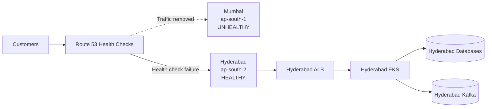

## Failover Sequence

```text
1. Mumbai health degradation detected
2. Route 53 health checks report failure
3. Incident Commander declares regional incident
4. Replication lag is verified
5. Hyderabad application capacity is validated
6. Database writer role is verified/promoted as required
7. Route 53 failover is activated
8. Hyderabad receives production traffic
9. Payment API health is verified
10. Transaction processing is monitored
11. Settlement and reconciliation checks begin
12. Incident communication is issued
```

---

# 6. Detailed Failover Data Flow

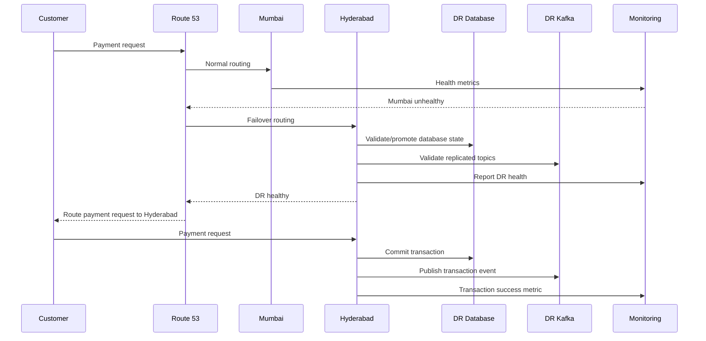

---

# 7. Replication-Lag Decision Flow

Replication status must be checked before a controlled regional failover.

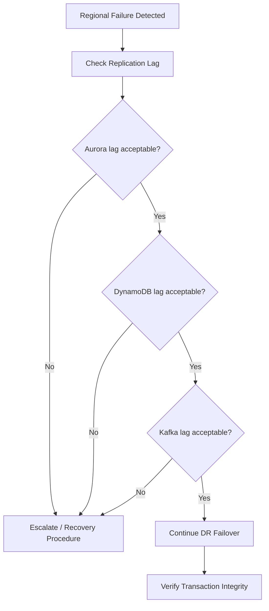

The exact thresholds are defined in the project's monitoring requirements and runbooks.

The failover operator must not assume that replication is current without checking the relevant metrics.

---

# 8. Hyderabad DR Processing Flow

After failover, Hyderabad becomes the active payment-processing environment.

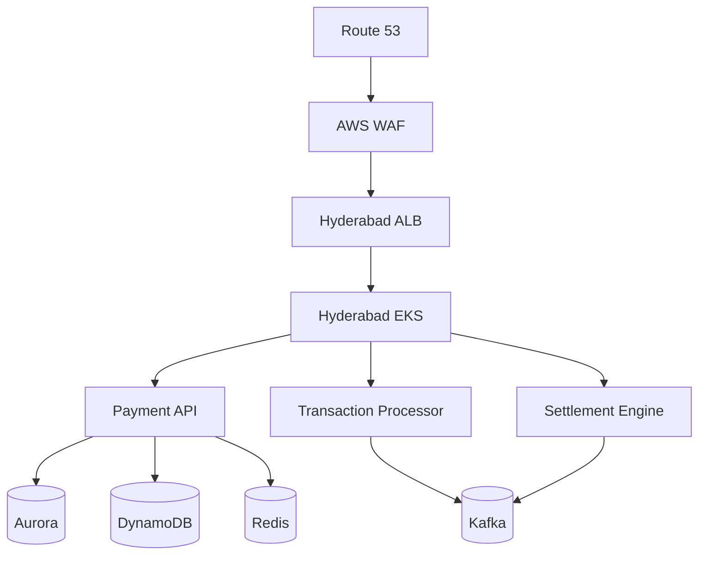

The DR environment must preserve the same security and compliance controls as the primary environment.

---

# 9. Transaction Idempotency During Failover

Payment transactions must not be processed twice when traffic moves between regions.

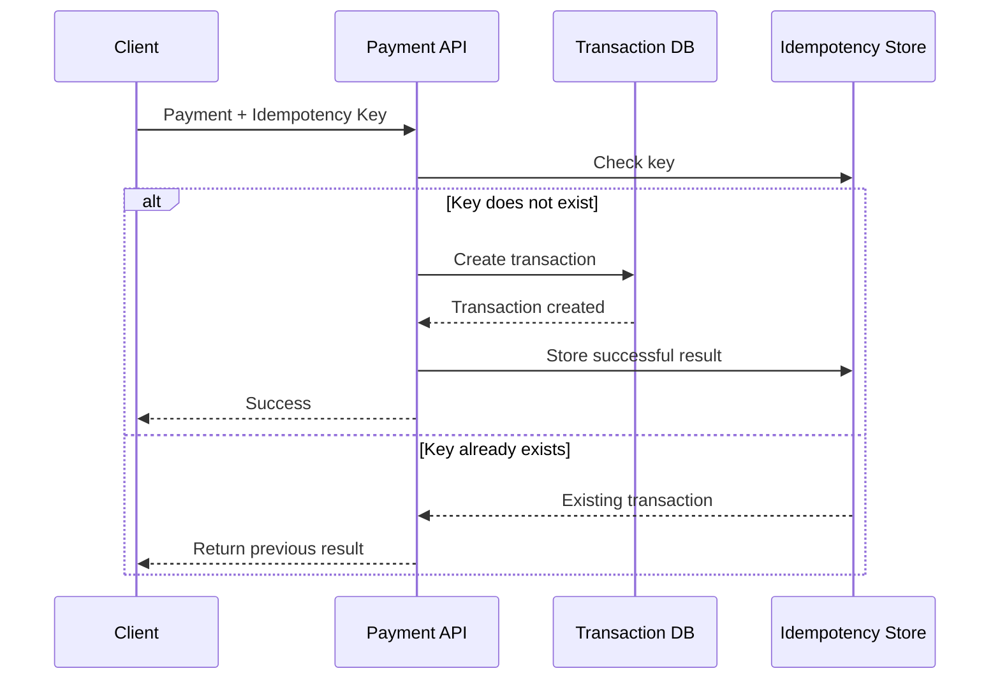

The idempotency key prevents a retry after failover from creating an additional transaction.

This control is particularly important for:

* Customer retries
* Network timeouts
* DNS transition
* Mid-transaction regional failure
* Application retries
* Kafka replay

---

# 10. Kafka Event Flow

Kafka carries asynchronous events such as transaction-processing and settlement events.

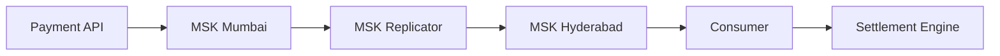

Kafka replication is asynchronous.

Therefore, the system monitors:

* Replication lag
* Consumer lag
* Topic availability
* Partition health
* Consumer offsets

Critical financial state must not rely solely on an unverified Kafka event being present in the DR region.

---

# 11. Recovery Back to Mumbai

After the Mumbai region has been repaired, traffic should not immediately switch back.

The recovery process should be controlled.

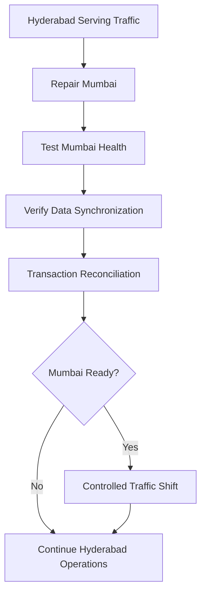

Before returning traffic to Mumbai:

1. Infrastructure must be healthy.
2. Database synchronization must be confirmed.
3. Kafka consumers must be healthy.
4. Payment APIs must pass health checks.
5. Security controls must be verified.
6. Transactions must be reconciled.
7. Monitoring must show stable operation.
8. Change approval must be obtained.

---

# 12. Compliance Evidence Flow

The architecture should produce evidence that the controls are operating.

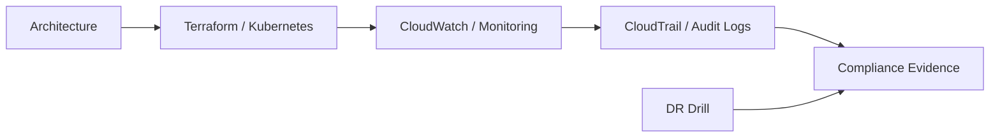

Evidence can include:

* Region configuration
* Replication metrics
* Health-check results
* IAM audit records
* KMS activity
* Network-policy configuration
* Failover timestamps
* Transaction reconciliation
* DR drill results
* Incident reports

---

# 13. Data Sovereignty Control Summary

The intended data flow follows these principles:

```text
Payment Data
     |
     +----> Mumbai — ap-south-1
     |
     +----> Encrypted Replication
     |
     +----> Hyderabad — ap-south-2
```

The architecture avoids making an overseas region part of the primary payment-data replication path.

Any non-payment operational data processed outside India must undergo separate legal, security, and compliance assessment.

---

# 14. Final Architecture Flow

The complete high-level flow is:

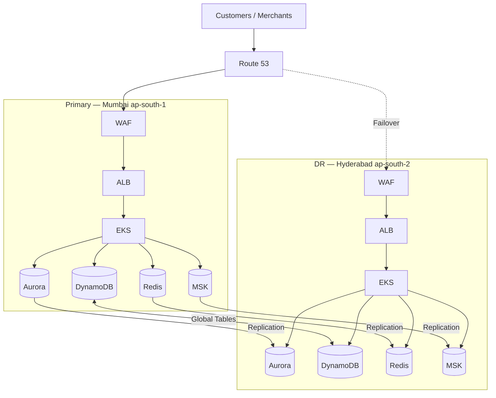

---

# 15. Conclusion

The PaySecure data-flow architecture provides a controlled path for payment processing, regional replication, disaster recovery, and transaction reconciliation.

The design keeps the primary payment-processing environments within Indian AWS regions and provides a clear failover path from Mumbai to Hyderabad.

The most important controls are:

* India-region payment data processing
* Encrypted cross-region replication
* Replication-lag monitoring
* Route 53 health-based failover
* Idempotency protection
* Transaction reconciliation
* Kafka replication monitoring
* Consistent security controls in both regions
* Audit evidence collection
* Controlled failback

These flows complement the compliance matrix and provide the implementation-level view required to demonstrate how data moves through the multi-region DR architecture.
